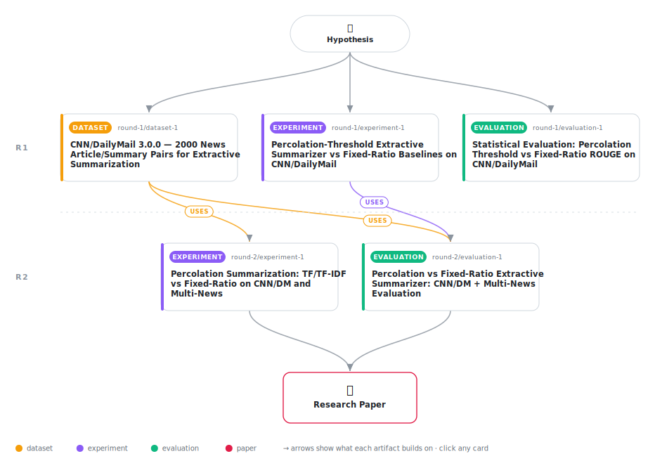

# Vocabulary Percolation Threshold for Self-Calibrating Extractive Summary Length: Recall Advantage and F1 Failure Mode Across Corpora

<div align="center">

<a href="https://cdn.jsdelivr.net/gh/AMGrobelnik/ai-invention-6a9498-vocabulary-percolation-threshold-for-sel@main/workflow.svg">
<picture>
  <source media="(prefers-color-scheme: dark)" srcset="workflow-dark.svg">
  
</picture>
</a>

<sub>🖱️ <b><a href="https://cdn.jsdelivr.net/gh/AMGrobelnik/ai-invention-6a9498-vocabulary-percolation-threshold-for-sel@main/workflow.svg">Open the interactive diagram</a></b> — every card links to its artifact folder.</sub>

</div>

> **TL;DR** — We propose and rigorously evaluate a percolation-threshold stopping criterion for extractive summarization: sentences are added until the induced vocabulary co-occurrence subgraph's giant connected component reaches fraction θ of the full document's GCC. On CNN/DailyMail (n=2000), the criterion achieves ROUGE-1 recall of 0.858 at θ=0.9 (vs. 0.578 for fixed@30%) but fails on F1 (best perc. 0.205 vs. fixed@20% 0.284) because newswire vocabulary is distributed throughout articles and requires 60–87% of sentences to percolate. On Multi-News (n=1000), percolation fires earlier (34.5% at θ=0.6), confirming the theoretical prediction about vocabulary clustering in multi-source documents, but fixed ratios still dominate F1. TF-IDF scoring reduces compression moderately without closing the F1 gap. Graph features explain only R²≈0.12 of compression variance, ruling out dynamic calibration from topology alone. The results establish a clear empirical baseline and identify the structural conditions—coverage-oriented references and diverse vocabulary clustering across document types—under which percolation-based length selection is most likely to succeed.

<details>
<summary>Full hypothesis</summary>

In word-frequency extractive summarization, a percolation-threshold stopping criterion—selecting sentences (by TF or TF-IDF score) until the induced vocabulary co-occurrence subgraph's giant connected component reaches a critical fraction θ of the full document's GCC—achieves significantly higher ROUGE recall than fixed-ratio baselines but lower ROUGE F1 on both newswire (CNN/DailyMail) and multi-source (Multi-News) corpora, because reference summaries target salience and brevity rather than vocabulary coverage completeness. Specifically: (a) on CNN/DailyMail (n=2000), percolation at θ=0.9 achieves ROUGE-1 recall ≈0.858 versus ≈0.578 for fixed@30%, but fixed@20% dominates on F1 (≈0.284 vs. ≈0.205 for TF-IDF percolation θ=0.6, the best percolation variant), because the GCC threshold fires at ≈37–87% of document sentences depending on scorer and θ—far above the ≈7–10% of journalist-written highlights; (b) on Multi-News (n=1000), percolation fires substantially earlier (CR≈0.345 at θ=0.6 for TF) than on CNN/DailyMail (CR≈0.597), confirming the theoretical prediction that multi-source vocabulary clustering triggers the GCC criterion earlier, yet fixed-ratio F1 still dominates (fixed@10%: 0.385 vs. percolation θ=0.6: 0.280); (c) compression ratio variance remains narrow on both corpora (std≤0.046 at all tested θ values on Multi-News, std=0.073–0.077 for TF and 0.083–0.087 for TF-IDF on CNN/DailyMail), universally below the 10 pp discriminative threshold, so percolation does not provide document-adaptive length selection within homogeneous corpora; (d) network feature regression reveals a scorer-conditional calibration signal: for TF scoring, R²≈0.12–0.13 (insufficient for reliable calibration), but for TF-IDF scoring, R²≈0.22–0.32 at θ=0.6–0.9, indicating that graph density moderately predicts TF-IDF percolation compression and warrants further investigation for adaptive stopping; and (e) the TF-IDF scorer selects fewer sentences than TF at the same θ (CR≈0.369 vs. 0.597 at θ=0.6 on CNN/DailyMail) because TF-IDF up-weights document-specific rare words that cluster in fewer sentences, concentrating the vocabulary GCC signal into a smaller sentence subset. The structural failure mode—that no tested θ produces ≈10% compression on either corpus, the minimum being CR≈34.5% on Multi-News θ=0.6—indicates the percolation criterion is architecturally misaligned with concise-highlights corpora but may be appropriate for coverage-oriented summarization tasks (scientific reviews, technical documentation) where completeness rather than brevity is the target. Future work should (i) add TextRank sentence scoring to test whether graph-scored + percolation-stopped summaries reduce the recall-precision gap via complementary graph signals; (ii) report TF-IDF results on Multi-News symmetrically with CNN/DailyMail; (iii) investigate whether TF-IDF R²≈0.32 at θ=0.6 enables practical adaptive θ calibration; and (iv) evaluate on corpora with heterogeneous document types (mixing focused and multi-topic documents) where within-corpus compression variance could exceed 10 pp.

</details>

[](https://cdn.jsdelivr.net/gh/AMGrobelnik/ai-invention-6a9498-vocabulary-percolation-threshold-for-sel@main/paper.pdf) [](https://github.com/AMGrobelnik/ai-invention-6a9498-vocabulary-percolation-threshold-for-sel/tree/main/paper_latex)

This repository contains all **5 artifacts** produced across **2 rounds** of an autonomous AI research run — round by round, exactly in the order they were invented.

## Round 1

| Artifact | Type | Demo | Source | Builds on |
|----------|------|------|--------|-----------|
| **[CNN/DailyMail 3.0.0 — 2000 News Article/Summary Pairs for Ex…](https://github.com/AMGrobelnik/ai-invention-6a9498-vocabulary-percolation-threshold-for-sel/tree/main/round-1/dataset-1)** | [](https://github.com/AMGrobelnik/ai-invention-6a9498-vocabulary-percolation-threshold-for-sel/tree/main/round-1/dataset-1) | [](https://colab.research.google.com/github/AMGrobelnik/ai-invention-6a9498-vocabulary-percolation-threshold-for-sel/blob/main/round-1/dataset-1/demo/data_code_demo.ipynb) | [](https://github.com/AMGrobelnik/ai-invention-6a9498-vocabulary-percolation-threshold-for-sel/tree/main/round-1/dataset-1/src) | — |
| **[Percolation-Threshold Extractive Summarizer vs Fixed-Ratio B…](https://github.com/AMGrobelnik/ai-invention-6a9498-vocabulary-percolation-threshold-for-sel/tree/main/round-1/experiment-1)** | [](https://github.com/AMGrobelnik/ai-invention-6a9498-vocabulary-percolation-threshold-for-sel/tree/main/round-1/experiment-1) | [](https://colab.research.google.com/github/AMGrobelnik/ai-invention-6a9498-vocabulary-percolation-threshold-for-sel/blob/main/round-1/experiment-1/demo/method_code_demo.ipynb) | [](https://github.com/AMGrobelnik/ai-invention-6a9498-vocabulary-percolation-threshold-for-sel/tree/main/round-1/experiment-1/src) | — |
| **[Statistical Evaluation: Percolation Threshold vs Fixed-Ratio…](https://github.com/AMGrobelnik/ai-invention-6a9498-vocabulary-percolation-threshold-for-sel/tree/main/round-1/evaluation-1)** | [](https://github.com/AMGrobelnik/ai-invention-6a9498-vocabulary-percolation-threshold-for-sel/tree/main/round-1/evaluation-1) | [](https://colab.research.google.com/github/AMGrobelnik/ai-invention-6a9498-vocabulary-percolation-threshold-for-sel/blob/main/round-1/evaluation-1/demo/eval_code_demo.ipynb) | [](https://github.com/AMGrobelnik/ai-invention-6a9498-vocabulary-percolation-threshold-for-sel/tree/main/round-1/evaluation-1/src) | — |

## Round 2

| Artifact | Type | Demo | Source | Builds on |
|----------|------|------|--------|-----------|
| **[Percolation Summarization: TF/TF-IDF vs Fixed-Ratio on CNN/D…](https://github.com/AMGrobelnik/ai-invention-6a9498-vocabulary-percolation-threshold-for-sel/tree/main/round-2/experiment-1)** | [](https://github.com/AMGrobelnik/ai-invention-6a9498-vocabulary-percolation-threshold-for-sel/tree/main/round-2/experiment-1) | [](https://colab.research.google.com/github/AMGrobelnik/ai-invention-6a9498-vocabulary-percolation-threshold-for-sel/blob/main/round-2/experiment-1/demo/method_code_demo.ipynb) | [](https://github.com/AMGrobelnik/ai-invention-6a9498-vocabulary-percolation-threshold-for-sel/tree/main/round-2/experiment-1/src) | <sub><i>uses:</i><br/>[dataset‑1&nbsp;(R1)](https://github.com/AMGrobelnik/ai-invention-6a9498-vocabulary-percolation-threshold-for-sel/tree/main/round-1/dataset-1)</sub> |
| **[Percolation vs Fixed-Ratio Extractive Summarizer: CNN/DM + M…](https://github.com/AMGrobelnik/ai-invention-6a9498-vocabulary-percolation-threshold-for-sel/tree/main/round-2/evaluation-1)** | [](https://github.com/AMGrobelnik/ai-invention-6a9498-vocabulary-percolation-threshold-for-sel/tree/main/round-2/evaluation-1) | [](https://colab.research.google.com/github/AMGrobelnik/ai-invention-6a9498-vocabulary-percolation-threshold-for-sel/blob/main/round-2/evaluation-1/demo/eval_code_demo.ipynb) | [](https://github.com/AMGrobelnik/ai-invention-6a9498-vocabulary-percolation-threshold-for-sel/tree/main/round-2/evaluation-1/src) | <sub><i>uses:</i><br/>[experiment‑1&nbsp;(R1)](https://github.com/AMGrobelnik/ai-invention-6a9498-vocabulary-percolation-threshold-for-sel/tree/main/round-1/experiment-1)<br/>[dataset‑1&nbsp;(R1)](https://github.com/AMGrobelnik/ai-invention-6a9498-vocabulary-percolation-threshold-for-sel/tree/main/round-1/dataset-1)</sub> |

## Repository Structure

Artifacts are grouped by the round of invention that produced them. Each
artifact has its own folder with source code and a self-contained demo:

```
.
├── round-1/                         # One folder per round of invention
│   ├── experiment-1/
│   │   ├── README.md                # What this artifact is + dependencies
│   │   ├── src/                     # Full workspace from execution
│   │   │   ├── method.py            # Main implementation
│   │   │   ├── method_out.json      # Full output data
│   │   │   └── ...                  # All execution artifacts
│   │   └── demo/                    # Self-contained demo
│   │       └── method_code_demo.ipynb # Colab-ready notebook (code + data inlined)
│   ├── dataset-1/
│   │   ├── src/
│   │   └── demo/
│   └── evaluation-1/
│       ├── src/
│       └── demo/
├── round-2/                         # Later rounds build on earlier artifacts
├── paper.pdf                        # Research paper
├── paper_latex/                     # LaTeX source files
├── workflow.svg                     # Artifact dependency diagram (this page's header)
└── README.md
```

## Running Notebooks

### Option 1: Google Colab (Recommended)

Click the "Open in Colab" badges above to run notebooks directly in your browser.
No installation required!

### Option 2: Local Jupyter

```bash
# Clone the repo
git clone https://github.com/AMGrobelnik/ai-invention-6a9498-vocabulary-percolation-threshold-for-sel
cd ai-invention-6a9498-vocabulary-percolation-threshold-for-sel

# Install dependencies
pip install jupyter

# Run any artifact's demo notebook
jupyter notebook <artifact_folder>/demo/
```

## Source Code

The original source files are in each artifact's `src/` folder.
These files may have external dependencies - use the demo notebooks for a self-contained experience.

---
*Generated by AI Inventor Pipeline - Automated Research Generation*
